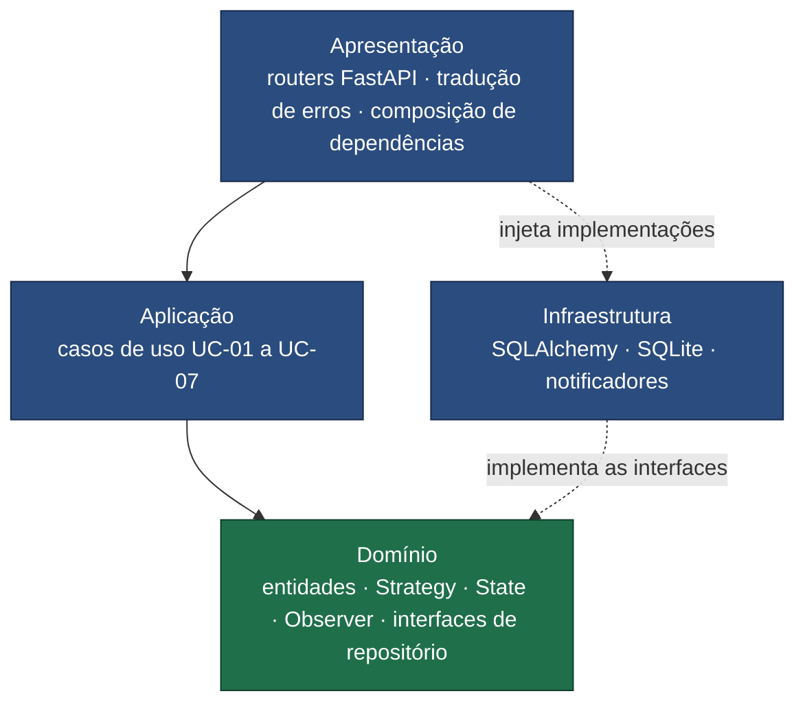

# AgendaLab

**Sistema de reserva de salas e laboratórios universitários.**

| | |
|---|---|
| **Disciplina** | Arquitetura de Software — Prof. MSc. Lucas Reis |
| **Autor** | Luiz Cutrim |
| **Curso** | Ciência da Computação — Universidade Federal do Maranhão (UFMA) |
| **Entrega** | 11/08/2026 |

---

## O que é

Espaços compartilhados numa universidade são disputados, e sem sistema a alocação vira planilha,
grupo de mensagens e caderno de portaria. O AgendaLab resolve três problemas concretos disso:
detecta conflito de horário no ato da solicitação, aplica políticas de admissão distintas por tipo de
espaço, e mantém a trilha de quem pediu e quem autorizou cada reserva.

São dois papéis — **solicitante** e **gestor** — e sete casos de uso. Nada além disso: o escopo é
estreito de propósito, e o que ficou de fora está registrado em ADR, não esquecido.

## Estado do projeto

> **Fase atual: base arquitetural concluída.** A documentação, os ADRs e os diagramas estão prontos.
> A implementação começa em seguida, dividida em 13 etapas. O sequenciamento e o cronograma estão em
> [`docs/ROADMAP.md`](docs/ROADMAP.md).

| Entregável | Situação |
|---|---|
| Especificação do MVP | ✅ concluída |
| Visões C4 (níveis 1, 2 e 3) | ✅ concluídas |
| 9 ADRs | ✅ concluídos |
| Documento de defesa | 🔶 esqueleto pronto; depende do código |
| Código-fonte | ⬜ a implementar |
| Suíte de testes | ⬜ a implementar |

## Como navegar a documentação

Comece por onde a sua pergunta se encaixa:

| Se você quer saber… | Leia |
|---|---|
| **por que** o sistema é assim | [ADRs](docs/ADRs/README.md) — 9 decisões, com alternativas rejeitadas |
| **o que** o sistema faz | [Especificação](docs/ESPECIFICACAO.md) — regras, casos de uso, contratos REST |
| **como** ele é estruturado | [Arquitetura](docs/ARQUITETURA.md) — 10 diagramas C4 e UML |
| a **defesa completa** do trabalho | [Documento de defesa](docs/DEFESA.md) — Opção B do enunciado |
| o vocabulário do domínio | [Glossário](docs/GLOSSARIO.md) — termos PT-BR ↔ código em inglês |

### As decisões em uma tabela

| Dimensão | Decisão | ADR |
|---|---|---|
| Padrão arquitetural | Camadas com inversão de dependência | [0001](docs/ADRs/0001-arquitetura-em-camadas.md) |
| Stack | Python 3.12+ · FastAPI · SQLAlchemy · SQLite | [0002](docs/ADRs/0002-stack-python-fastapi.md) |
| Persistência | Repository com modelos separados do domínio | [0003](docs/ADRs/0003-persistencia-sqlite-repository.md) |
| Design pattern 1 | **Strategy** — políticas de admissão por tipo de espaço | [0004](docs/ADRs/0004-strategy-politicas-de-reserva.md) |
| Design pattern 2 | **State** — ciclo de vida da reserva | [0005](docs/ADRs/0005-state-ciclo-de-vida-da-reserva.md) |
| Design pattern 3 | **Observer** — notificação de eventos | [0006](docs/ADRs/0006-observer-notificacoes.md) |
| Testes | TDD, pirâmide e teste de arquitetura executável | [0009](docs/ADRs/0009-estrategia-de-testes.md) |

## Arquitetura em uma imagem



**Nenhuma seta sólida sai do domínio.** Ele é o único pacote que não importa ninguém — e é por isso
que roda em teste sem banco, sem FastAPI e sem rede. Essa regra não é convenção: é verificada por
`tests/architecture/test_dependency_rule.py`, que analisa os imports de cada módulo e falha a suíte
se uma camada interna importar uma externa.

## Como executar

> ⬜ Disponível quando a implementação começar. Os comandos abaixo são os previstos e serão
> confirmados de ponta a ponta antes da entrega.

```bash
python3 -m venv .venv && source .venv/bin/activate
pip install -e ".[dev]"
uvicorn agendalab.presentation.main:app --reload
```

Documentação interativa da API em `http://127.0.0.1:8000/docs`.

**Requisitos:** Python 3.12 ou superior. Nenhum serviço externo — o banco é um arquivo SQLite criado
na primeira execução.

### Testes

```bash
pytest
```

```bash
pytest --cov --cov-report=term-missing
```

### Validar os diagramas da documentação

Um bloco Mermaid com erro de sintaxe aparece no GitHub como bloco quebrado — falha silenciosa até
alguém abrir a página. Este script extrai todo diagrama de `docs/` e o submete ao `mermaid-cli`:

```bash
python3 scripts/valida_diagramas.py
```

Requer Node.js no PATH.

## ⚠️ Limitações conhecidas

Estas não são falhas descobertas depois — são fronteiras desenhadas e registradas.

- **O sistema não tem autenticação e é inseguro por construção.** A identidade chega por cabeçalho
  HTTP (`X-User-Id`, `X-User-Role`) e o sistema confia nela: qualquer cliente pode se declarar
  gestor. A **autorização**, essa sim, está implementada por inteiro — um solicitante que tente
  aprovar uma reserva recebe `403`. A distinção e o raciocínio estão em
  [ADR-0007](docs/ADRs/0007-autenticacao-fora-de-escopo.md). **Não exponha esta aplicação em rede.**
- **A caixa de notificações (`GET /notifications`) vive em memória** e se perde no reinício. É
  instrumento de demonstração do padrão Observer, não funcionalidade de produto
  ([ADR-0006](docs/ADRs/0006-observer-notificacoes.md)).
- **Reserva dupla sob concorrência real é teoricamente possível.** A verificação de conflito e a
  inserção são duas operações. Na prática, o SQLite serializa escritas e a aplicação roda com um
  worker único. A solução correta seria restrição de exclusão temporal no banco
  ([ADR-0003](docs/ADRs/0003-persistencia-sqlite-repository.md)).
- **Sem migrações de banco.** Alterar o esquema exige recriá-lo.

## Estrutura do repositório

```
.
├── docs/
│   ├── ADRs/                9 decisões arquiteturais + template
│   ├── ESPECIFICACAO.md     domínio, casos de uso, regras e contratos REST
│   ├── ARQUITETURA.md       10 diagramas Mermaid (C4 e UML)
│   ├── GLOSSARIO.md         linguagem ubíqua PT-BR ↔ código
│   ├── DEFESA.md            documento de defesa — Opção B
│   ├── ROADMAP.md           sequenciamento da implementação em 13 etapas
│   ├── imagens/             capturas de tela da defesa
│   └── Projeto_final.pdf    enunciado da disciplina
├── scripts/
│   └── valida_diagramas.py  verificação automatizada dos diagramas
├── src/agendalab/           código-fonte (a implementar)
├── tests/                   suíte de testes (a implementar)
└── pyproject.toml
```
