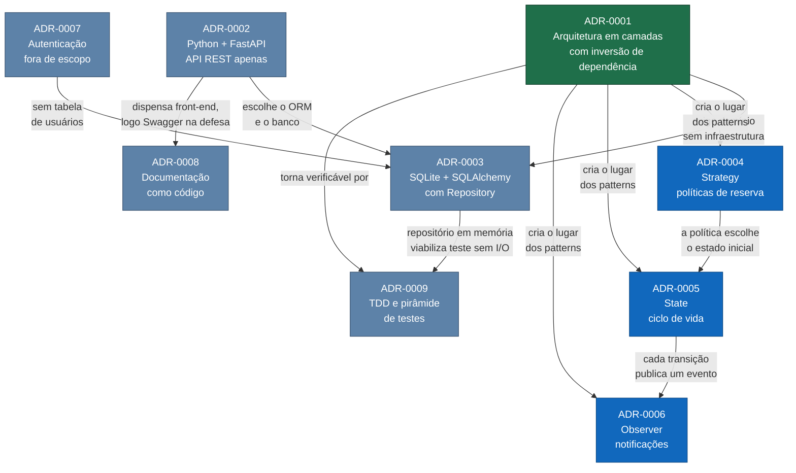

# Architecture Decision Records — AgendaLab

Um ADR registra **uma** decisão arquitetural: o contexto que a tornou necessária, as alternativas que
foram genuinamente avaliadas, a decisão tomada e o que ela custa. Um ADR não é documentação de como o
sistema funciona — para isso existem a [especificação](../ESPECIFICACAO.md) e as
[visões arquiteturais](../ARQUITETURA.md). Um ADR responde *por que* o sistema é assim, e o que
deixaria de ser verdade se a decisão fosse revertida.

O enunciado exige no mínimo dois ADRs, com Contexto, Decisão e Consequências. Este projeto tem nove,
e cada um estende esse formato com duas seções:

- **Alternativas consideradas** — as opções descartadas, com prós reais. Uma alternativa listada só
  com defeitos não foi avaliada, foi encenada.
- **Conformidade** — o arquivo e o teste que comprovam, olhando o repositório, que a decisão está
  sendo respeitada. É o que separa um ADR auditável de uma justificativa retrospectiva.

## Índice

| # | Decisão | Status | Tema |
|---|---|---|---|
| [0001](0001-arquitetura-em-camadas.md) | Adotar arquitetura em camadas com inversão de dependência | Aceito | arquitetura |
| [0002](0002-stack-python-fastapi.md) | Implementar em Python com FastAPI e expor apenas API REST | Aceito | stack |
| [0003](0003-persistencia-sqlite-repository.md) | Persistir em SQLite via SQLAlchemy, com Repository e modelos separados do domínio | Aceito | persistência |
| [0004](0004-strategy-politicas-de-reserva.md) | Aplicar o padrão **Strategy** às políticas de admissão de reserva | Aceito | design pattern |
| [0005](0005-state-ciclo-de-vida-da-reserva.md) | Aplicar o padrão **State** ao ciclo de vida da reserva | Aceito | design pattern |
| [0006](0006-observer-notificacoes.md) | Aplicar o padrão **Observer** à notificação de eventos de reserva | Aceito | design pattern |
| [0007](0007-autenticacao-fora-de-escopo.md) | Manter autenticação fora de escopo, implementando apenas a autorização | Aceito | escopo |
| [0008](0008-documentacao-e-diagramas-como-codigo.md) | Manter documentação e diagramas como código, em Markdown e Mermaid | Aceito | documentação |
| [0009](0009-estrategia-de-testes.md) | Adotar TDD com pirâmide de testes e um teste de arquitetura executável | Aceito | testes |

[Template em branco](0000-template.md) para novos registros.

## Como as decisões se sustentam

O **ADR-0001 é a decisão fundacional**: ele estabelece a regra de dependência, e é dela que decorre
tanto a exigência de manter o ORM fora do domínio quanto o lugar onde os três patterns podem morar.
Revertê-lo invalidaria, em cascata, quase todas as demais.

Os três ADRs de padrão de projeto não são independentes entre si: a política escolhe o estado inicial
da reserva ([0004](0004-strategy-politicas-de-reserva.md) → [0005](0005-state-ciclo-de-vida-da-reserva.md))
e cada transição de estado publica um evento
([0005](0005-state-ciclo-de-vida-da-reserva.md) → [0006](0006-observer-notificacoes.md)). Os três
colaboram no mesmo fluxo, visível no
[diagrama de sequência do UC-04](../ARQUITETURA.md#9-sequência--solicitar-reserva).

## Convenções

- **Numeração** sequencial e imutável. Um ADR nunca é renumerado nem apagado.
- **Status** é `Proposto`, `Aceito`, `Substituído por ADR-YYYY` ou `Depreciado`. Uma decisão revista
  não é editada: escreve-se um ADR novo e o antigo passa a `Substituído`, preservando o histórico do
  raciocínio.
- **Nome do arquivo:** `NNNN-titulo-em-kebab-case.md`.
- **Título** no imperativo, descrevendo a ação decidida ("Adotar…", "Aplicar…", "Manter…").
