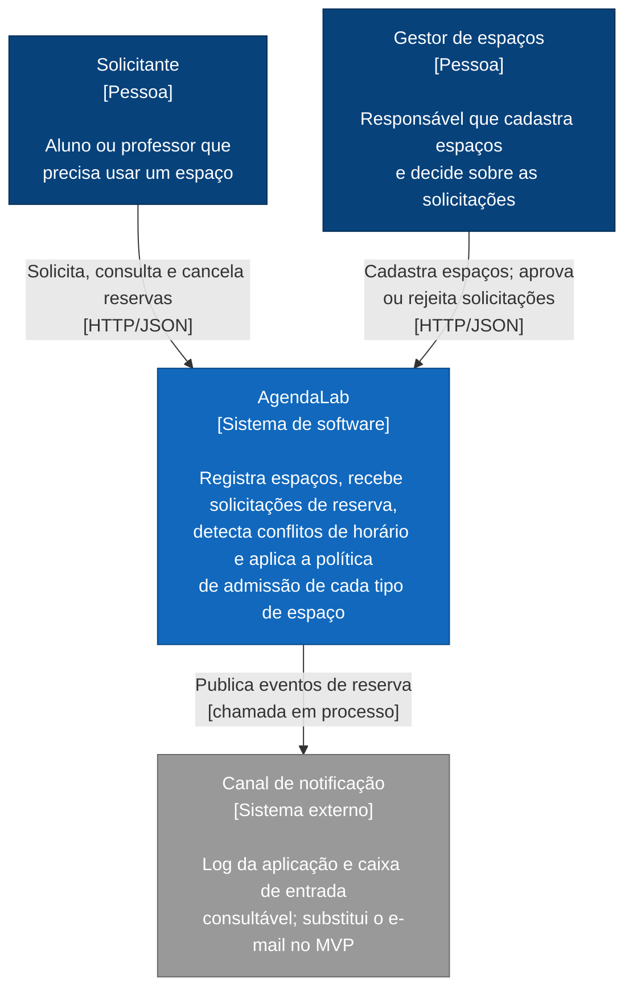
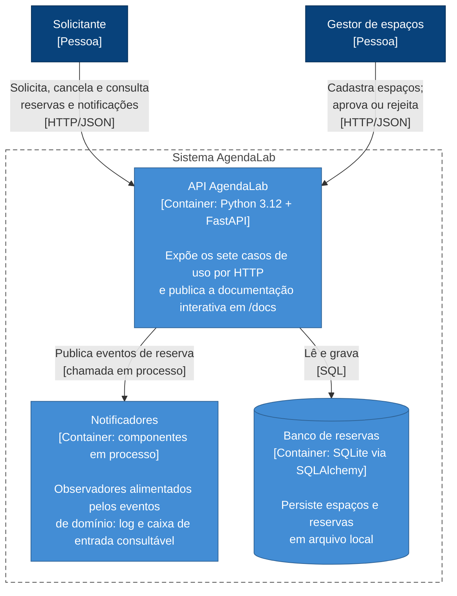
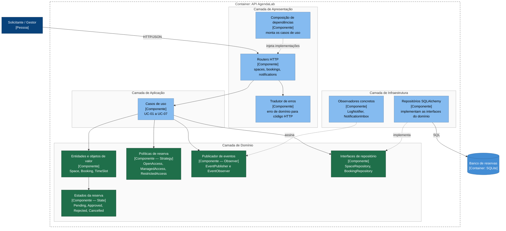
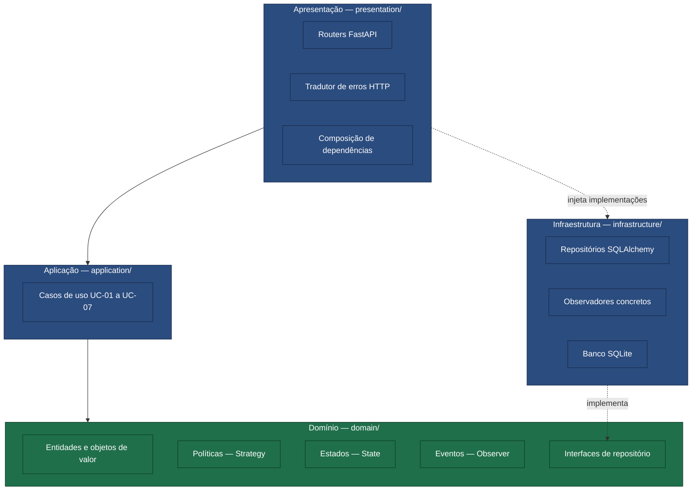
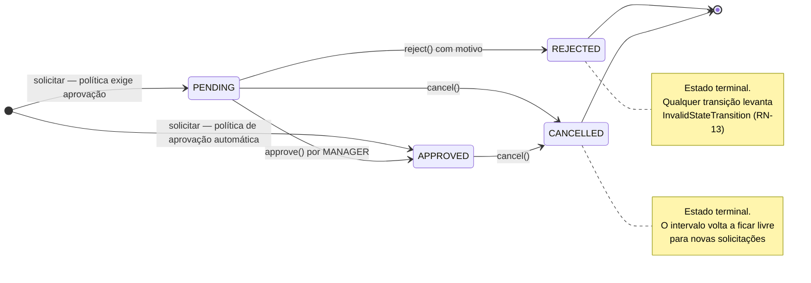
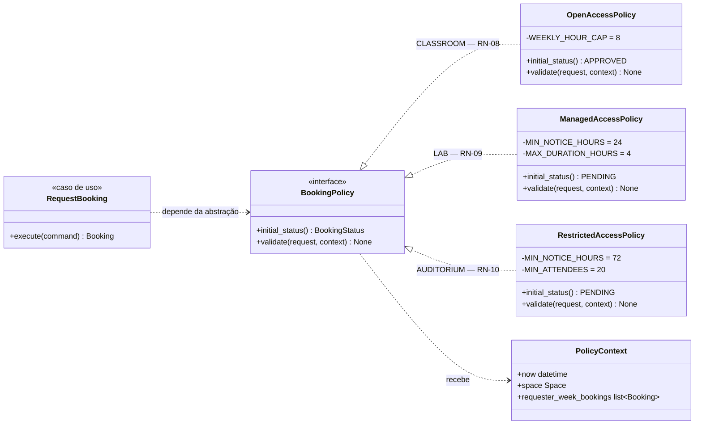
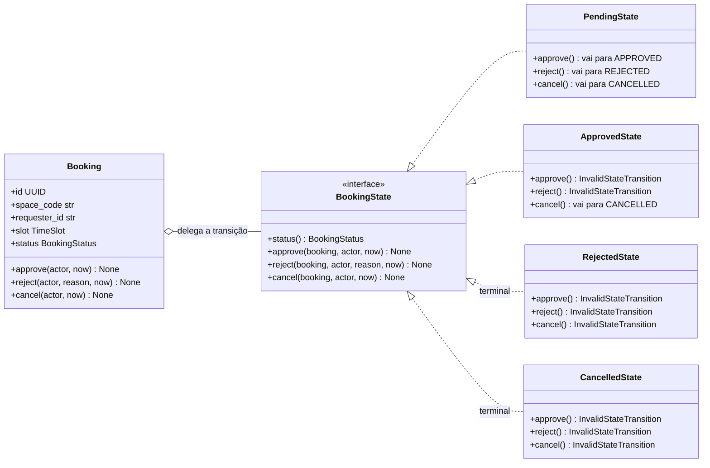
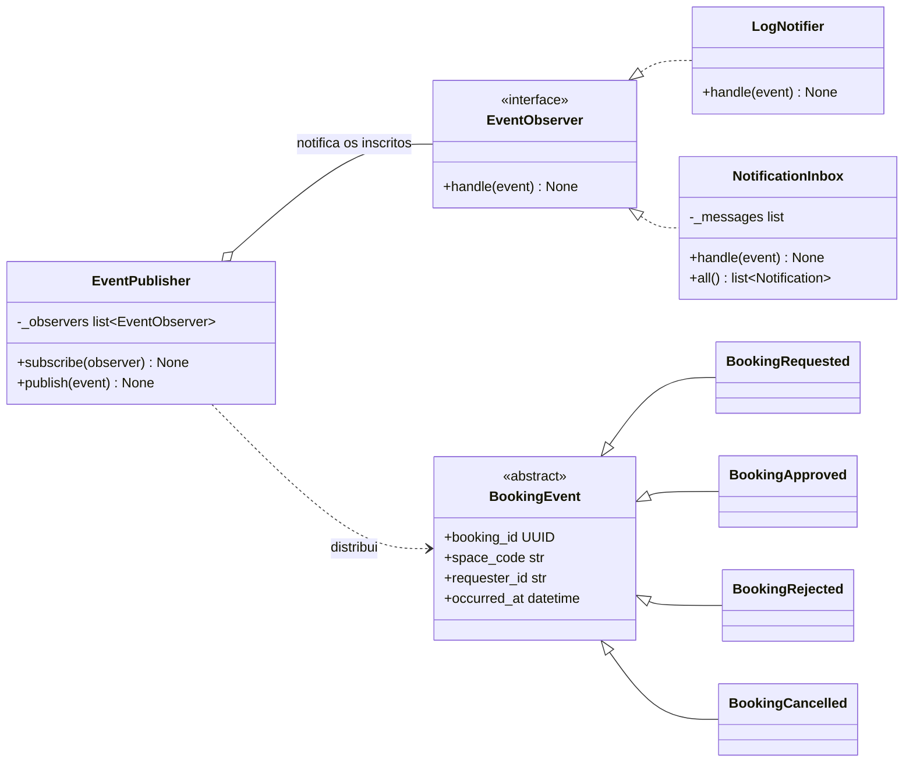
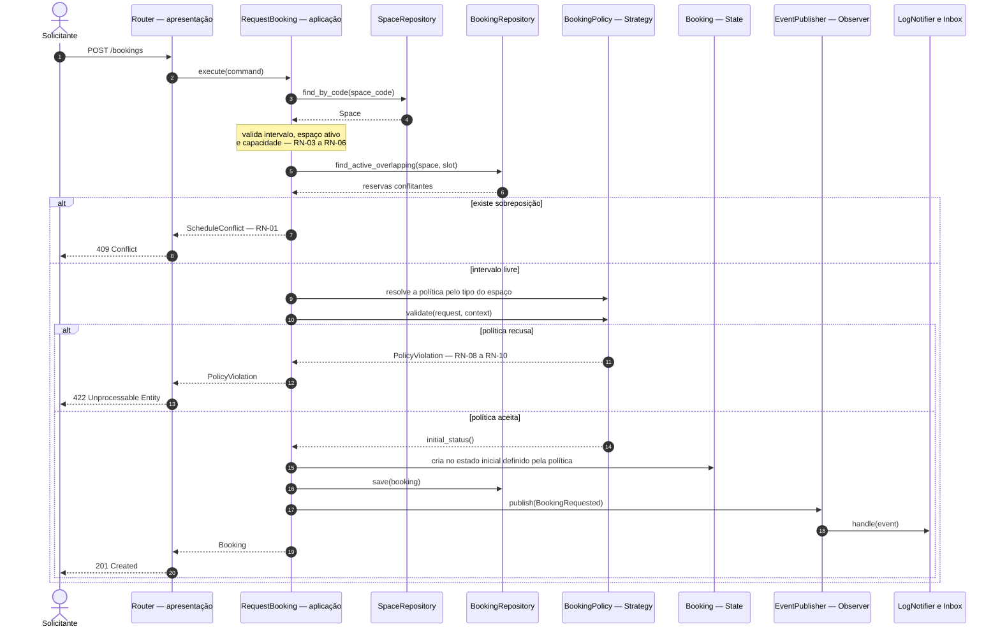
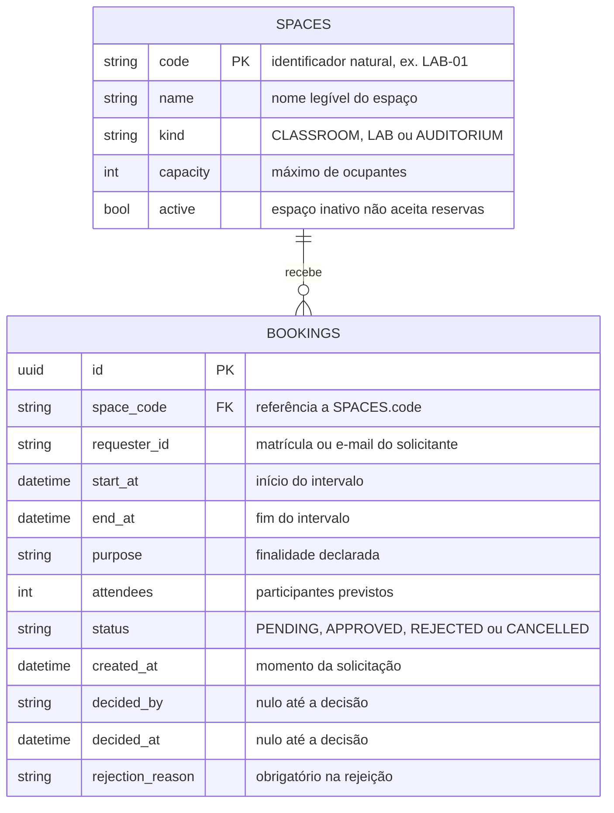

# Visões Arquiteturais — AgendaLab

| | |
|---|---|
| **Sistema** | AgendaLab — reserva de salas e laboratórios |
| **Autor** | Luiz Cutrim — Ciência da Computação — UFMA |
| **Data** | 05/08/2026 |
| **Notação** | C4 Model (Níveis 1 a 3) e UML, escritos em Mermaid.js |

Todos os diagramas deste documento são **gerados a partir de código-fonte** versionado junto com o
projeto — não há imagem binária a manter em sincronia. A decisão e seus trade-offs estão em
[ADR-0008](ADRs/0008-documentacao-e-diagramas-como-codigo.md).

> **Nota sobre a notação C4.** Os diagramas C4 abaixo usam `flowchart` com a paleta e a convenção
> visual do C4 Model, e não as diretivas `C4Context`/`C4Container`/`C4Component` nativas do Mermaid.
> A escolha foi tomada após teste: as diretivas nativas são marcadas como experimentais e seu
> auto-layout produziu sobreposição de rótulos sobre as caixas, comprometendo a legibilidade. O
> registro completo está em [ADR-0008](ADRs/0008-documentacao-e-diagramas-como-codigo.md).

**Legenda de cores** (padrão C4): azul-escuro = pessoa · azul = sistema em foco · cinza = sistema
externo · azul-claro = componente · verde = componente da camada de domínio.

---

## 1. C4 Nível 1 — Contexto

Quem usa o AgendaLab e com o que ele conversa. Nenhum detalhe interno aparece aqui — é a visão que
um coordenador de curso entenderia.

O "canal de notificação" é desenhado como sistema externo por honestidade de modelagem: no MVP ele é
implementado dentro do processo (log e caixa de entrada em memória), mas ocupa a posição
arquitetural de um serviço externo de mensageria. Trocá-lo por e-mail real não altera nenhuma outra
caixa deste diagrama — é justamente o que o padrão Observer preserva
([ADR-0006](ADRs/0006-observer-notificacoes.md)).

## 2. C4 Nível 2 — Container

As unidades executáveis e de armazenamento do sistema.

São três containers, e essa contagem é deliberadamente baixa. O sistema é um **monólito modular**:
um único processo, um único banco em arquivo. A alternativa de microsserviços foi avaliada e
rejeitada — o argumento está em [ADR-0001](ADRs/0001-arquitetura-em-camadas.md). Os "Notificadores"
aparecem como container separado porque são um ponto de extensão previsto, ainda que hoje rodem no
mesmo processo.

## 3. C4 Nível 3 — Componentes

O interior da API, agrupado pelas quatro camadas. Este nível vai além do que o enunciado exige, mas
é onde a arquitetura fica de fato verificável.

Duas setas merecem atenção porque são o coração da arquitetura, e ambas estão **tracejadas e
apontando para dentro**:

- `Repositórios SQLAlchemy ⇢ Interfaces de repositório` — a infraestrutura depende do domínio, e não
  o contrário.
- `Observadores concretos ⇢ Publicador de eventos` — o notificador assina; o domínio não conhece
  quem escuta.

## 4. Camadas e regra de dependência

A mesma informação da seção anterior, reduzida ao essencial: quem pode depender de quem.

**A regra, em uma frase:** nenhuma seta sólida sai do domínio. Ele é o único pacote que não importa
ninguém — e é por isso que roda em teste sem banco, sem FastAPI e sem rede.

A camada de apresentação é o **composition root**: é o único lugar que conhece simultaneamente as
abstrações e as implementações concretas, porque é ela quem as conecta. Isso não viola a regra de
dependência; é o preço, concentrado num único ponto, de mantê-la em todo o resto do sistema.

Esta regra é verificada automaticamente por `tests/architecture/test_dependency_rule.py`, que analisa
os imports de cada módulo por AST e falha se uma camada interna importar uma externa
([RNF-01, RNF-02](ESPECIFICACAO.md#9-requisitos-não-funcionais)).

## 5. Máquina de estados da reserva

Implementa a tabela de transições de
[ESPECIFICACAO §5.5](ESPECIFICACAO.md#55-tabela-de-transições-de-estado) e é a base do
[ADR-0005](ADRs/0005-state-ciclo-de-vida-da-reserva.md).

Note as **duas setas de entrada**: uma reserva pode nascer `PENDING` ou já `APPROVED`, dependendo da
política do tipo de espaço. É o ponto exato em que o Strategy e o State se encontram — a estratégia
escolhe o estado inicial, e o estado governa o que acontece dali em diante.

## 6. Classes — Strategy das políticas

`RequestBooking` conhece apenas `BookingPolicy`. Acrescentar um quarto tipo de espaço significa criar
uma classe nova — nenhum arquivo existente é editado. Detalhamento em
[ADR-0004](ADRs/0004-strategy-politicas-de-reserva.md).

## 7. Classes — State da reserva

`Booking` não decide se uma transição é válida — ela pergunta ao seu estado atual. É a diferença
entre um `if status == ...` replicado em cada caso de uso e uma regra que existe num lugar só.
Detalhamento em [ADR-0005](ADRs/0005-state-ciclo-de-vida-da-reserva.md).

## 8. Classes — Observer de eventos

O `EventPublisher` vive no domínio; `LogNotifier` e `NotificationInbox` vivem na infraestrutura e
apenas assinam. Um canal novo — e-mail, push, webhook — é uma classe a mais, sem tocar no domínio.
Detalhamento em [ADR-0006](ADRs/0006-observer-notificacoes.md).

## 9. Sequência — solicitar reserva

O fluxo do [UC-04](ESPECIFICACAO.md#uc-04--solicitar-reserva), onde os três padrões colaboram na
mesma operação.

Observe que `RequestBooking` conversa apenas com **abstrações**: `SpaceRepository`,
`BookingRepository` e `BookingPolicy` são todos contratos declarados no domínio. Em nenhum passo o
caso de uso menciona SQLAlchemy, SQLite ou FastAPI. É por isso que ele é testável isoladamente com
repositórios em memória.

## 10. Modelo entidade-relacionamento

O esquema físico gerado pelos modelos SQLAlchemy — deliberadamente separado das entidades de
domínio, conforme [ADR-0003](ADRs/0003-persistencia-sqlite-repository.md).

Não há tabela de usuários — coerente com [ADR-0007](ADRs/0007-autenticacao-fora-de-escopo.md).
`requester_id` e `decided_by` são identificadores opacos, sem integridade referencial, porque não
existe entidade para referenciar.

---

## Índice de rastreabilidade

| Diagrama | Nível/Notação | Documento que o justifica |
|---|---|---|
| [1 — Contexto](#1-c4-nível-1--contexto) | C4 N1 | exigência do enunciado |
| [2 — Container](#2-c4-nível-2--container) | C4 N2 | exigência do enunciado |
| [3 — Componentes](#3-c4-nível-3--componentes) | C4 N3 | [ADR-0001](ADRs/0001-arquitetura-em-camadas.md) |
| [4 — Camadas](#4-camadas-e-regra-de-dependência) | UML informal | [ADR-0001](ADRs/0001-arquitetura-em-camadas.md) |
| [5 — Estados](#5-máquina-de-estados-da-reserva) | UML de estados | [ADR-0005](ADRs/0005-state-ciclo-de-vida-da-reserva.md) |
| [6 — Strategy](#6-classes--strategy-das-políticas) | UML de classes | [ADR-0004](ADRs/0004-strategy-politicas-de-reserva.md) |
| [7 — State](#7-classes--state-da-reserva) | UML de classes | [ADR-0005](ADRs/0005-state-ciclo-de-vida-da-reserva.md) |
| [8 — Observer](#8-classes--observer-de-eventos) | UML de classes | [ADR-0006](ADRs/0006-observer-notificacoes.md) |
| [9 — Sequência](#9-sequência--solicitar-reserva) | UML de sequência | [ESPECIFICACAO UC-04](ESPECIFICACAO.md#uc-04--solicitar-reserva) |
| [10 — ER](#10-modelo-entidade-relacionamento) | Entidade-relacionamento | [ADR-0003](ADRs/0003-persistencia-sqlite-repository.md) |
