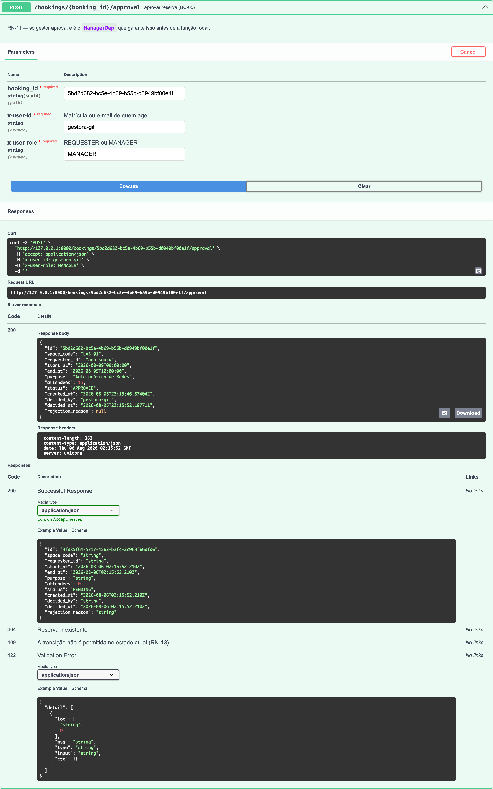
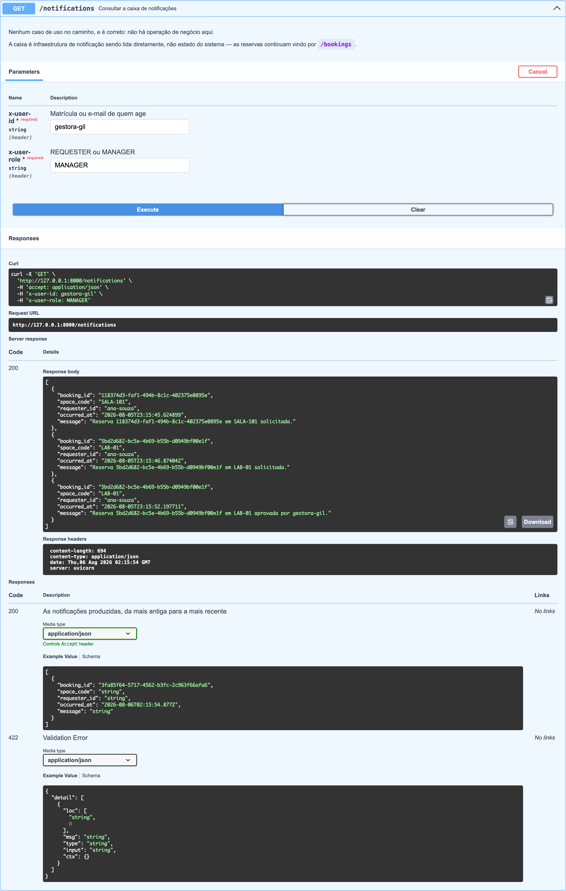
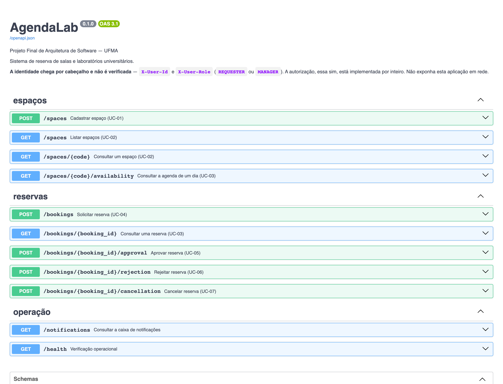
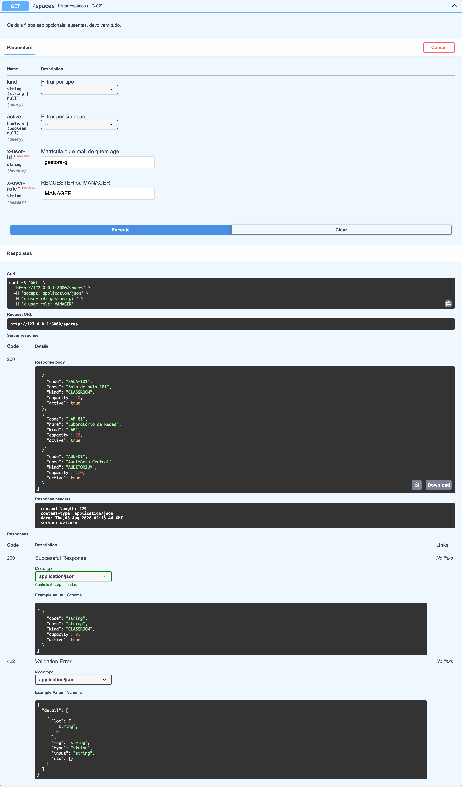
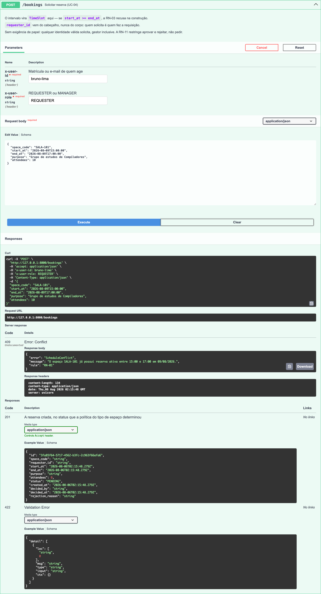
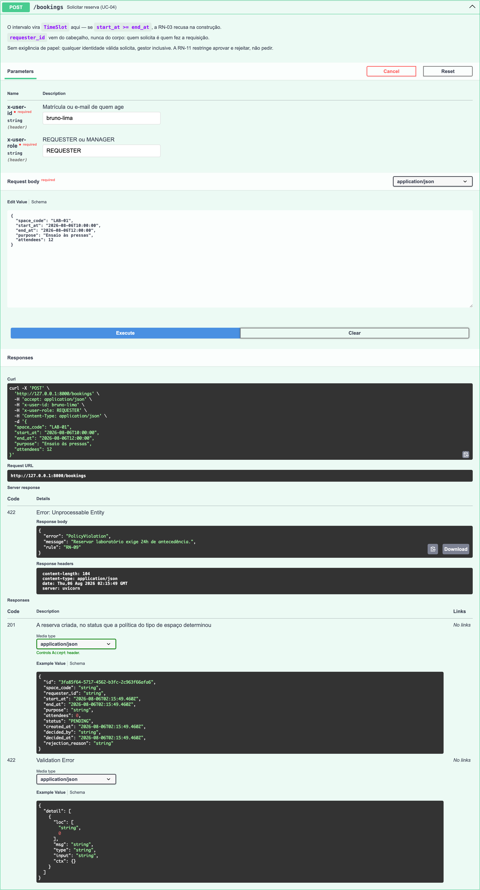
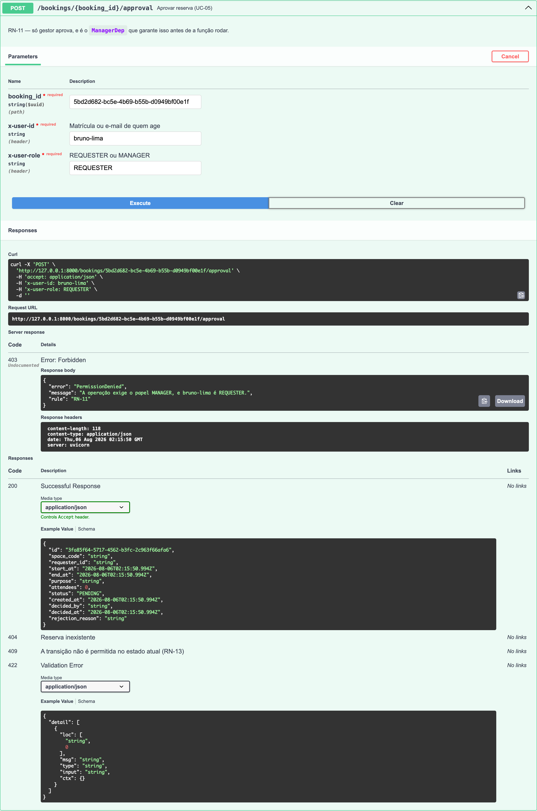
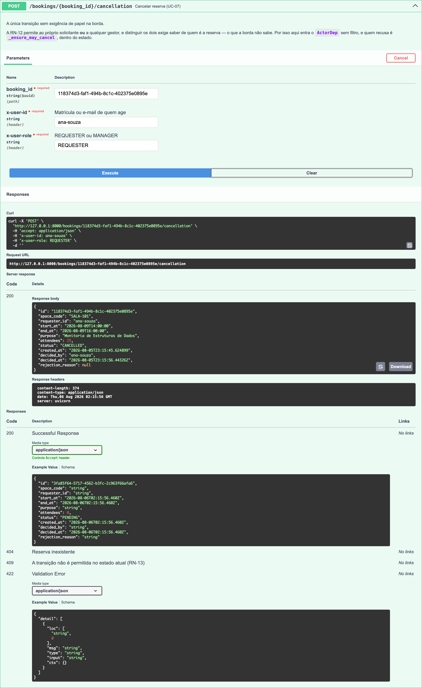
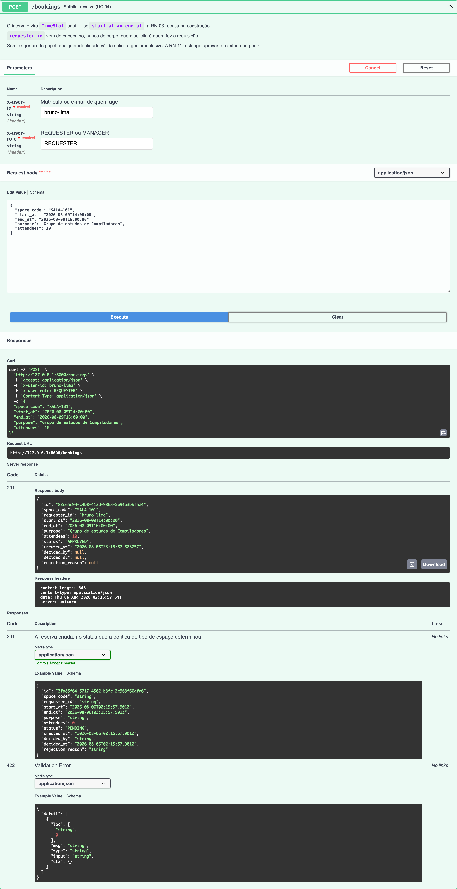

# Documento de Defesa — AgendaLab

**Sistema de reserva de salas e laboratórios universitários**

| | |
|---|---|
| **Disciplina** | Arquitetura de Software |
| **Professor** | MSc. Lucas Reis |
| **Autor** | Luiz Cutrim |
| **Curso** | Ciência da Computação |
| **Instituição** | Universidade Federal do Maranhão — UFMA |
| **Repositório** | https://github.com/ziulG/AgendaLab |
| **Data de entrega** | 11/08/2026 |

> Este documento corresponde à **Opção B** do material explicativo previsto no enunciado: documento
> textual formal com o passo a passo da explicação do projeto, capturas de tela do sistema rodando,
> trechos do código onde os padrões foram aplicados e a justificativa técnica completa.

---

## Sumário

1. [O problema e a solução](#1-o-problema-e-a-solução)
2. [Como executar o sistema](#2-como-executar-o-sistema)
3. [Visões arquiteturais](#3-visões-arquiteturais)
4. [O padrão arquitetural adotado](#4-o-padrão-arquitetural-adotado)
5. [Design pattern 1 — Strategy](#5-design-pattern-1--strategy)
6. [Design pattern 2 — State](#6-design-pattern-2--state)
7. [Design pattern 3 — Observer](#7-design-pattern-3--observer)
8. [Princípios de projeto: as evidências](#8-princípios-de-projeto-as-evidências)
9. [Demonstração do sistema em funcionamento](#9-demonstração-do-sistema-em-funcionamento)
10. [Testes e resultados](#10-testes-e-resultados)
11. [Trade-offs assumidos e o que ficou fora](#11-trade-offs-assumidos-e-o-que-ficou-fora)
12. [Limitações conhecidas e evolução](#12-limitações-conhecidas-e-evolução)
13. [Índice de decisões arquiteturais](#13-índice-de-decisões-arquiteturais)

---

## 1. O problema e a solução

Espaços compartilhados numa universidade — salas de aula, laboratórios, auditório — são disputados.
Sem sistema, a alocação acontece por planilha, grupo de mensagens ou caderno na portaria, e três
problemas decorrem disso: reservas duplicadas descobertas só na hora do uso, regras de liberação que
existem apenas na cabeça de quem controla, e ausência de qualquer rastro de quem pediu e quem
autorizou.

O **AgendaLab** é um MVP que ataca os três: detecta conflito de horário no ato da solicitação, aplica
políticas de admissão distintas por tipo de espaço e mantém a trilha de decisão de cada reserva.

O escopo é deliberadamente estreito — sete casos de uso, listados em
[ESPECIFICACAO §6](ESPECIFICACAO.md#6-casos-de-uso). O que ficou de fora está em
[§11](#11-trade-offs-assumidos-e-o-que-ficou-fora), por decisão registrada e não por omissão.

## 2. Como executar o sistema

```bash
git clone https://github.com/ziulG/AgendaLab.git
cd AgendaLab
python3 -m venv .venv && source .venv/bin/activate
pip install -e ".[dev]"
uvicorn agendalab.presentation.main:app --reload
```

Os comandos foram executados de ponta a ponta em 05/08/2026, a partir de um clone limpo do
repositório publicado. A saída real de cada um — com três edições de legibilidade, todas marcadas
ou descritas: a saída do `pip` truncada, sua última linha quebrada para caber na largura do
documento, e o caminho local abreviado para `/…/`:

```text
$ git clone https://github.com/ziulG/AgendaLab.git
Cloning into 'AgendaLab'...

$ pip install -e ".[dev]"
[... resolução e download das dependências: saída truncada ...]
Successfully installed agendalab-0.1.0 annotated-doc-0.0.5 annotated-types-0.8.0 anyio-4.14.2
certifi-2026.7.22 click-8.4.2 coverage-7.15.3 fastapi-0.141.1 freezegun-1.5.5 h11-0.16.0
httpcore-1.0.9 httptools-0.8.0 httpx-0.28.1 idna-3.18 iniconfig-2.3.0 packaging-26.3 pluggy-1.6.0
pydantic-2.13.4 pydantic-core-2.46.4 pydantic-settings-2.14.2 pygments-2.20.0 pytest-9.1.1
pytest-cov-7.1.0 python-dateutil-2.9.0.post0 python-dotenv-1.2.2 pyyaml-6.0.3 ruff-0.16.1
six-1.17.0 sqlalchemy-2.0.51 starlette-1.4.1 typing-extensions-4.16.0 typing-inspection-0.4.2
uvicorn-0.52.1 uvloop-0.22.1 watchfiles-1.2.0 websockets-17.0.1

$ uvicorn agendalab.presentation.main:app --reload
INFO:     Will watch for changes in these directories: ['/…/AgendaLab']
INFO:     Uvicorn running on http://127.0.0.1:8000 (Press CTRL+C to quit)
INFO:     Started reloader process [75903] using WatchFiles
INFO:     Started server process [75907]
INFO:     Waiting for application startup.
INFO:     Application startup complete.
```

Com a aplicação no ar, a documentação interativa fica em `http://127.0.0.1:8000/docs`, e o arquivo
`agendalab.db` aparece na raiz do clone na primeira execução — criado pelo `lifespan` da aplicação,
como prometido abaixo.

Requisitos: Python 3.12 ou superior. Nenhum serviço externo — o banco é um arquivo SQLite criado na
primeira execução ([ADR-0003](ADRs/0003-persistencia-sqlite-repository.md)).

## 3. Visões arquiteturais

O sistema é documentado pelo **C4 Model** nos níveis 1 (Contexto), 2 (Container) e 3 (Componentes).
Todos os diagramas são gerados por código Mermaid versionado — não há imagem binária a manter em
sincronia ([ADR-0008](ADRs/0008-documentacao-e-diagramas-como-codigo.md)).

Os diagramas completos, com a narrativa de cada visão, estão em
**[ARQUITETURA.md](ARQUITETURA.md)**:

| Visão | Pergunta que responde |
|---|---|
| [Nível 1 — Contexto](ARQUITETURA.md#1-c4-nível-1--contexto) | Quem usa o sistema e com o que ele conversa |
| [Nível 2 — Container](ARQUITETURA.md#2-c4-nível-2--container) | Quais são as unidades executáveis e de armazenamento |
| [Nível 3 — Componentes](ARQUITETURA.md#3-c4-nível-3--componentes) | Como a API se organiza por dentro |
| [Camadas](ARQUITETURA.md#4-camadas-e-regra-de-dependência) | Quem pode depender de quem |

Uma nota metodológica: as diretivas `C4Context`/`C4Container` nativas do Mermaid foram testadas e
descartadas — seu auto-layout sobrepõe os rótulos das relações às caixas, comprometendo a
legibilidade. Os diagramas usam `flowchart` com a paleta e a convenção do C4 Model. O registro do
teste e da decisão está em [ADR-0008](ADRs/0008-documentacao-e-diagramas-como-codigo.md).

## 4. O padrão arquitetural adotado

O AgendaLab adota **arquitetura em camadas com inversão de dependência**, em quatro camadas:

| Camada | Responsabilidade | Pode depender de |
|---|---|---|
| Apresentação | Expor HTTP, traduzir erros, compor as dependências | todas |
| Aplicação | Orquestrar o domínio em casos de uso | domínio |
| Domínio | Regras de negócio e **as interfaces de repositório** | nada |
| Infraestrutura | Implementar as interfaces do domínio | domínio |

### Por que não MVC

MVC é o primeiro padrão citado pelo enunciado e o de vocabulário mais reconhecível. Foi rejeitado por
uma razão concreta: **o sistema não tem View**. A interface é uma API REST, e um dos três componentes
do padrão ficaria vazio ou seria forçado a significar "serializador JSON". O risco maior é conhecido:
na prática do MVC em frameworks web, a regra de negócio migra para os controllers ou para models que
herdam do ORM — e ambos acoplam a regra à infraestrutura, que é exatamente o oposto do que a
disciplina avalia.

### Por que não microsserviços

Duas entidades e sete casos de uso. Não há requisito de escala, times separados ou deploy
independente. Microsserviços introduziriam consistência eventual, comunicação em rede e orquestração
— problemas inteiramente criados pela própria escolha.

### A decisão que sustenta tudo

O detalhe que torna esta arquitetura defensável, e não apenas uma organização de pastas:

> **As interfaces `SpaceRepository` e `BookingRepository` são declaradas em
> `domain/repositories.py`, não na infraestrutura.**

O domínio declara o que precisa; a infraestrutura obedece. A seta de dependência da infraestrutura
aponta *para dentro*. A consequência prática está em [§8](#8-princípios-de-projeto-as-evidências).

Análise completa das alternativas em [ADR-0001](ADRs/0001-arquitetura-em-camadas.md).

## 5. Design pattern 1 — Strategy

**Onde:** `src/agendalab/domain/policies/` · **ADR:** [0004](ADRs/0004-strategy-politicas-de-reserva.md)

### O problema

Cada tipo de espaço tem regras próprias de admissão:

| Tipo | Aprovação | Antecedência mínima | Regra adicional |
|---|---|---|---|
| `CLASSROOM` | automática | — | teto de 8h por solicitante na semana |
| `LAB` | gestor | 24h | duração máxima de 4h |
| `AUDITORIUM` | gestor | 72h | mínimo de 20 participantes |

Essas regras não diferem apenas em parâmetros — diferem em estrutura. "Teto de horas na semana" e
"mínimo de participantes" são verificações de naturezas distintas, sobre dados distintos.

Sem o padrão, o caso de uso `RequestBooking` teria uma condicional por tipo, e passaria a ter três
razões diferentes para mudar. Um quarto tipo de espaço exigiria editar um arquivo já testado.

### A solução

A interface tem dois métodos: o estado em que a reserva nasce e a validação. É um `Protocol` — as
três políticas concretas não herdam dela, e a conformidade estrutural é verificada por teste.

**`src/agendalab/domain/policies/booking_policy.py`, linhas 55–61:**

```python
@runtime_checkable
class BookingPolicy(Protocol):
    def initial_status(self) -> BookingStatus:
        """Estado em que a reserva nasce sob esta política (RN-07)."""

    def validate(self, request: BookingRequest, context: PolicyContext) -> None:
        """Passa em silêncio, ou levanta `PolicyViolation` com a regra que recusou."""
```

Uma política concreta — a dos laboratórios, com as duas verificações da RN-09:

**`src/agendalab/domain/policies/managed_access.py`, linhas 19–37:**

```python
class ManagedAccessPolicy:
    MIN_NOTICE_HOURS = 24
    MAX_DURATION_HOURS = 4

    def initial_status(self) -> BookingStatus:
        return BookingStatus.PENDING

    def validate(self, request: BookingRequest, context: PolicyContext) -> None:
        """RN-09 — antecedência mínima e duração máxima, nesta ordem."""
        if request.slot.start_at - context.now < timedelta(hours=self.MIN_NOTICE_HOURS):
            raise PolicyViolation(
                f"Reservar laboratório exige {self.MIN_NOTICE_HOURS}h de antecedência.",
                "RN-09",
            )
        if request.slot.duration_hours() > self.MAX_DURATION_HOURS:
            raise PolicyViolation(
                f"Uma reserva de laboratório não pode passar de {self.MAX_DURATION_HOURS}h.",
                "RN-09",
            )
```

### Diagrama

[ARQUITETURA §6 — Classes, Strategy das políticas](ARQUITETURA.md#6-classes--strategy-das-políticas)

### A evidência

`RequestBooking` não menciona `CLASSROOM`, `LAB` nem `AUDITORIUM` em lugar algum — conversa apenas
com a abstração `BookingPolicy`. Acrescentar um quarto tipo de espaço é criar uma classe; nenhum
arquivo existente muda. É o princípio aberto/fechado com demonstração concreta.

Saída de `pytest tests/unit/policies -v -o addopts=""` — o `-o addopts=""` desativa o `-q` que é
padrão do projeto. Os nomes dos casos são a especificação das três políticas, borda por borda:

```text
============================= test session starts ==============================
platform darwin -- Python 3.12.13, pytest-9.1.1, pluggy-1.6.0 -- /Users/luizg/FinalProjectAS/.venv/bin/python
cachedir: .pytest_cache
rootdir: /Users/luizg/FinalProjectAS
configfile: pyproject.toml
plugins: cov-7.1.0, anyio-4.14.2
collecting ... collected 39 items

tests/unit/policies/test_managed_access.py::test_laboratorio_exige_decisao_do_gestor PASSED [  2%]
tests/unit/policies/test_managed_access.py::test_solicitacao_dentro_das_regras_e_aceita PASSED [  5%]
tests/unit/policies/test_managed_access.py::test_exatamente_vinte_e_quatro_horas_de_antecedencia_passa PASSED [  7%]
tests/unit/policies/test_managed_access.py::test_um_minuto_a_menos_de_antecedencia_recusa PASSED [ 10%]
tests/unit/policies/test_managed_access.py::test_reserva_para_daqui_a_pouco_recusa PASSED [ 12%]
tests/unit/policies/test_managed_access.py::test_exatamente_quatro_horas_de_duracao_passa PASSED [ 15%]
tests/unit/policies/test_managed_access.py::test_quatro_horas_e_um_minuto_recusa PASSED [ 17%]
tests/unit/policies/test_managed_access.py::test_antecedencia_e_verificada_antes_da_duracao PASSED [ 20%]
tests/unit/policies/test_open_access.py::test_sala_de_aula_tem_aprovacao_automatica PASSED [ 23%]
tests/unit/policies/test_open_access.py::test_primeira_reserva_da_semana_e_aceita PASSED [ 25%]
tests/unit/policies/test_open_access.py::test_exatamente_oito_horas_na_semana_passa PASSED [ 28%]
tests/unit/policies/test_open_access.py::test_oito_horas_e_um_minuto_na_semana_recusa PASSED [ 30%]
tests/unit/policies/test_open_access.py::test_a_reserva_em_analise_conta_no_total PASSED [ 33%]
tests/unit/policies/test_open_access.py::test_uma_unica_reserva_acima_do_teto_recusa PASSED [ 35%]
tests/unit/policies/test_open_access.py::test_horas_quebradas_somam_sem_erro_de_arredondamento PASSED [ 38%]
tests/unit/policies/test_open_access.py::test_reserva_inativa_nao_ocupa_o_teto[REJECTED] PASSED [ 41%]
tests/unit/policies/test_open_access.py::test_reserva_inativa_nao_ocupa_o_teto[CANCELLED] PASSED [ 43%]
tests/unit/policies/test_open_access.py::test_reserva_ativa_ocupa_o_teto[PENDING] PASSED [ 46%]
tests/unit/policies/test_open_access.py::test_reserva_ativa_ocupa_o_teto[APPROVED] PASSED [ 48%]
tests/unit/policies/test_open_access.py::test_reserva_de_outra_semana_nao_ocupa_o_teto PASSED [ 51%]
tests/unit/policies/test_open_access.py::test_o_teto_segue_a_semana_da_reserva_e_nao_a_de_hoje PASSED [ 53%]
tests/unit/policies/test_registry.py::test_todo_tipo_de_espaco_tem_politica[CLASSROOM] PASSED [ 56%]
tests/unit/policies/test_registry.py::test_todo_tipo_de_espaco_tem_politica[LAB] PASSED [ 58%]
tests/unit/policies/test_registry.py::test_todo_tipo_de_espaco_tem_politica[AUDITORIUM] PASSED [ 61%]
tests/unit/policies/test_registry.py::test_cada_tipo_recebe_a_politica_da_especificacao[CLASSROOM] PASSED [ 64%]
tests/unit/policies/test_registry.py::test_cada_tipo_recebe_a_politica_da_especificacao[LAB] PASSED [ 66%]
tests/unit/policies/test_registry.py::test_cada_tipo_recebe_a_politica_da_especificacao[AUDITORIUM] PASSED [ 69%]
tests/unit/policies/test_registry.py::test_toda_politica_registrada_satisfaz_o_protocolo[CLASSROOM] PASSED [ 71%]
tests/unit/policies/test_registry.py::test_toda_politica_registrada_satisfaz_o_protocolo[LAB] PASSED [ 74%]
tests/unit/policies/test_registry.py::test_toda_politica_registrada_satisfaz_o_protocolo[AUDITORIUM] PASSED [ 76%]
tests/unit/policies/test_registry.py::test_politicas_distintas_para_tipos_distintos PASSED [ 79%]
tests/unit/policies/test_restricted_access.py::test_auditorio_exige_decisao_do_gestor PASSED [ 82%]
tests/unit/policies/test_restricted_access.py::test_solicitacao_dentro_das_regras_e_aceita PASSED [ 84%]
tests/unit/policies/test_restricted_access.py::test_exatamente_setenta_e_duas_horas_de_antecedencia_passa PASSED [ 87%]
tests/unit/policies/test_restricted_access.py::test_um_minuto_a_menos_de_antecedencia_recusa PASSED [ 89%]
tests/unit/policies/test_restricted_access.py::test_antecedencia_do_auditorio_e_maior_que_a_do_laboratorio PASSED [ 92%]
tests/unit/policies/test_restricted_access.py::test_exatamente_vinte_participantes_passa PASSED [ 94%]
tests/unit/policies/test_restricted_access.py::test_dezenove_participantes_recusa PASSED [ 97%]
tests/unit/policies/test_restricted_access.py::test_antecedencia_e_verificada_antes_dos_participantes PASSED [100%]

============================== 39 passed in 0.02s ==============================
```

### Uma nota sobre honestidade na contagem

A resolução de tipo para política é um dicionário (`POLICY_BY_KIND`). **Não o chamamos de Factory
Method.** É um `dict`, e rotulá-lo com nome de padrão para elevar a contagem de patterns do trabalho
seria inflar o que existe. Os três padrões declarados resolvem problemas reais deste domínio; este
não é um quarto.

## 6. Design pattern 2 — State

**Onde:** `src/agendalab/domain/states/` · **ADR:** [0005](ADRs/0005-state-ciclo-de-vida-da-reserva.md)

### O problema

Uma reserva passa por quatro situações, e nem toda operação é válida em todas elas:

| Estado atual | `approve` | `reject` | `cancel` |
|---|---|---|---|
| `PENDING` | ✅ → `APPROVED` | ✅ → `REJECTED` | ✅ → `CANCELLED` |
| `APPROVED` | ❌ | ❌ | ✅ → `CANCELLED` |
| `REJECTED` | ❌ | ❌ | ❌ |
| `CANCELLED` | ❌ | ❌ | ❌ |

O estado governa mais do que a transição: só reservas `PENDING` e `APPROVED` ocupam o horário para
efeito da detecção de conflito, e só a rejeição exige motivo. A pergunta "esta transição é
permitida?" é apenas uma das perguntas que dependem do estado — e foi isso que descartou a
alternativa de uma tabela declarativa de transições.

### A solução

A **recusa é o comportamento padrão da classe base**: os três métodos de transição levantam
`InvalidStateTransition` no contrato, e cada estado concreto sobrescreve apenas o que permite.

**`src/agendalab/domain/states/booking_state.py`, linhas 28–40:**

```python
class BookingState(ABC):
    @abstractmethod
    def status(self) -> BookingStatus:
        """O membro de `BookingStatus` que este estado representa."""

    def approve(self, booking: Booking, actor: Actor, now: datetime) -> None:
        raise InvalidStateTransition(self.status(), "approve")

    def reject(self, booking: Booking, actor: Actor, reason: str, now: datetime) -> None:
        raise InvalidStateTransition(self.status(), "reject")

    def cancel(self, booking: Booking, actor: Actor, now: datetime) -> None:
        raise InvalidStateTransition(self.status(), "cancel")
```

Os estados concretos vivem em `concrete_states.py`. O `PendingState` é o único que aceita as três
transições — e é toda a primeira linha da tabela acima, em código:

**`src/agendalab/domain/states/concrete_states.py`, linhas 23–40:**

```python
class PendingState(BookingState):
    """Aguardando decisão. Aceita as três transições."""

    def status(self) -> BookingStatus:
        return BookingStatus.PENDING

    def approve(self, booking: Booking, actor: Actor, now: datetime) -> None:
        self._record_decision(booking, BookingStatus.APPROVED, actor, now)

    def reject(self, booking: Booking, actor: Actor, reason: str, now: datetime) -> None:
        if not reason.strip():
            raise MissingRejectionReason()  # RN-14 — antes de transicionar, não depois
        self._record_decision(booking, BookingStatus.REJECTED, actor, now)
        booking.rejection_reason = reason

    def cancel(self, booking: Booking, actor: Actor, now: datetime) -> None:
        self._ensure_may_cancel(booking, actor)  # RN-12
        self._record_decision(booking, BookingStatus.CANCELLED, actor, now)
```

O ônus da escrita é invertido: um estado novo é seguro por omissão. Se o autor esquecer de habilitar
uma transição, o sistema recusa — em vez de permitir indevidamente. `RejectedState` e
`CancelledState`, no mesmo arquivo, não sobrescrevem transição alguma: são terminais, e ler as
quatro classes é ler a tabela.

### Diagramas

[ARQUITETURA §5 — Máquina de estados](ARQUITETURA.md#5-máquina-de-estados-da-reserva) ·
[§7 — Classes, State](ARQUITETURA.md#7-classes--state-da-reserva)

### A evidência

Os casos de uso `ApproveBooking`, `RejectBooking` e `CancelBooking` não comparam `booking.status` para
decidir se prosseguem. `Booking` delega ao seu estado atual, e a regra de ciclo de vida existe em um
só lugar.

Saída de `pytest tests/unit/states/test_transitions.py -v -o addopts=""`. Os identificadores dos
casos parametrizados são as células da tabela: 4 permitidas, 8 recusadas, e a própria contagem de
12 é afirmada por um teste:

```text
============================= test session starts ==============================
platform darwin -- Python 3.12.13, pytest-9.1.1, pluggy-1.6.0 -- /Users/luizg/FinalProjectAS/.venv/bin/python
cachedir: .pytest_cache
rootdir: /Users/luizg/FinalProjectAS
configfile: pyproject.toml
plugins: cov-7.1.0, anyio-4.14.2
collecting ... collected 31 items

tests/unit/states/test_transitions.py::test_a_tabela_tem_doze_celulas PASSED [  3%]
tests/unit/states/test_transitions.py::test_transicao_permitida_leva_ao_estado_esperado[PENDING-approve] PASSED [  6%]
tests/unit/states/test_transitions.py::test_transicao_permitida_leva_ao_estado_esperado[PENDING-reject] PASSED [  9%]
tests/unit/states/test_transitions.py::test_transicao_permitida_leva_ao_estado_esperado[PENDING-cancel] PASSED [ 12%]
tests/unit/states/test_transitions.py::test_transicao_permitida_leva_ao_estado_esperado[APPROVED-cancel] PASSED [ 16%]
tests/unit/states/test_transitions.py::test_transicao_permitida_registra_quem_decidiu_e_quando[PENDING-approve] PASSED [ 19%]
tests/unit/states/test_transitions.py::test_transicao_permitida_registra_quem_decidiu_e_quando[PENDING-reject] PASSED [ 22%]
tests/unit/states/test_transitions.py::test_transicao_permitida_registra_quem_decidiu_e_quando[PENDING-cancel] PASSED [ 25%]
tests/unit/states/test_transitions.py::test_transicao_permitida_registra_quem_decidiu_e_quando[APPROVED-cancel] PASSED [ 29%]
tests/unit/states/test_transitions.py::test_transicao_proibida_e_recusada[APPROVED-approve] PASSED [ 32%]
tests/unit/states/test_transitions.py::test_transicao_proibida_e_recusada[APPROVED-reject] PASSED [ 35%]
tests/unit/states/test_transitions.py::test_transicao_proibida_e_recusada[REJECTED-approve] PASSED [ 38%]
tests/unit/states/test_transitions.py::test_transicao_proibida_e_recusada[REJECTED-reject] PASSED [ 41%]
tests/unit/states/test_transitions.py::test_transicao_proibida_e_recusada[REJECTED-cancel] PASSED [ 45%]
tests/unit/states/test_transitions.py::test_transicao_proibida_e_recusada[CANCELLED-approve] PASSED [ 48%]
tests/unit/states/test_transitions.py::test_transicao_proibida_e_recusada[CANCELLED-reject] PASSED [ 51%]
tests/unit/states/test_transitions.py::test_transicao_proibida_e_recusada[CANCELLED-cancel] PASSED [ 54%]
tests/unit/states/test_transitions.py::test_transicao_proibida_nao_altera_a_reserva[APPROVED-approve] PASSED [ 58%]
tests/unit/states/test_transitions.py::test_transicao_proibida_nao_altera_a_reserva[APPROVED-reject] PASSED [ 61%]
tests/unit/states/test_transitions.py::test_transicao_proibida_nao_altera_a_reserva[REJECTED-approve] PASSED [ 64%]
tests/unit/states/test_transitions.py::test_transicao_proibida_nao_altera_a_reserva[REJECTED-reject] PASSED [ 67%]
tests/unit/states/test_transitions.py::test_transicao_proibida_nao_altera_a_reserva[REJECTED-cancel] PASSED [ 70%]
tests/unit/states/test_transitions.py::test_transicao_proibida_nao_altera_a_reserva[CANCELLED-approve] PASSED [ 74%]
tests/unit/states/test_transitions.py::test_transicao_proibida_nao_altera_a_reserva[CANCELLED-reject] PASSED [ 77%]
tests/unit/states/test_transitions.py::test_transicao_proibida_nao_altera_a_reserva[CANCELLED-cancel] PASSED [ 80%]
tests/unit/states/test_transitions.py::test_rejeicao_guarda_o_motivo PASSED [ 83%]
tests/unit/states/test_transitions.py::test_rejeicao_sem_motivo_e_recusada[vazio] PASSED [ 87%]
tests/unit/states/test_transitions.py::test_rejeicao_sem_motivo_e_recusada[espacos] PASSED [ 90%]
tests/unit/states/test_transitions.py::test_rejeicao_sem_motivo_e_recusada[quebra_de_linha] PASSED [ 93%]
tests/unit/states/test_transitions.py::test_rejeicao_sem_motivo_nao_altera_a_reserva PASSED [ 96%]
tests/unit/states/test_transitions.py::test_aprovacao_e_cancelamento_nao_preenchem_motivo PASSED [100%]

============================== 31 passed in 0.01s ==============================
```

## 7. Design pattern 3 — Observer

**Onde:** `src/agendalab/domain/events/` e `infrastructure/notifications/` ·
**ADR:** [0006](ADRs/0006-observer-notificacoes.md)

### O problema

Quando uma reserva muda de situação, coisas precisam acontecer: avisar o solicitante, avisar o
gestor, registrar auditoria. Nada disso é a operação de negócio — são reações a ela. São quatro
momentos (solicitação, aprovação, rejeição, cancelamento) e o número de canais tende a crescer.

Chamar o notificador direto do caso de uso faria o número de pontos a editar crescer por
multiplicação: 4 transições × N canais.

### A solução

O sujeito e a interface do observador vivem no domínio; os observadores concretos, na
infraestrutura. O publicador conhece apenas a interface:

**`src/agendalab/domain/events/publisher.py`, linhas 19–51:**

```python
@runtime_checkable
class EventObserver(Protocol):
    def handle(self, event: BookingEvent) -> None:
        """Reage ao evento. Uma falha aqui não interrompe a operação que o originou."""


class EventPublisher:
    def __init__(self) -> None:
        # Lista, e não conjunto: a entrega segue a ordem de inscrição.
        self._observers: list[EventObserver] = []

    def subscribe(self, observer: EventObserver) -> None:
        self._observers.append(observer)

    def publish(self, event: BookingEvent) -> None:
        """Entrega o evento a todos os inscritos, isolando a falha de cada um.

        Uma reserva legitimamente aprovada não pode ser desfeita porque o log falhou: notificação
        é efeito colateral, e efeito colateral não invalida o fato. A exceção é registrada e não
        se propaga, e não impede os demais observadores de receberem o evento.

        `Exception`, e não `BaseException`: `KeyboardInterrupt` e `SystemExit` precisam continuar
        subindo, senão um Ctrl-C viraria silêncio.
        """
        for observer in self._observers:
            try:
                observer.handle(event)
            except Exception:
                logger.exception(
                    "Observador %s falhou ao tratar %s; os demais seguem sendo notificados.",
                    type(observer).__name__,
                    type(event).__name__,
                )
```

O registro dos observadores concretos acontece uma única vez, no composition root — a função
`create_app`:

**`src/agendalab/presentation/main.py`, linhas 76–83:**

```python
    # O Observer, montado. O publicador conhece a interface; estes dois a implementam, e nenhum
    # deles é conhecido pelo domínio. Um terceiro canal seria mais uma linha `subscribe`.
    inbox = NotificationInbox()
    publisher = EventPublisher()
    publisher.subscribe(LogNotifier())
    publisher.subscribe(inbox)
    app.state.inbox = inbox
    app.state.publisher = publisher
```

Um detalhe de projeto que merece destaque: **falha de observador não derruba a operação de negócio**.
O `publish` isola cada observador — uma reserva legitimamente aprovada não deve ser desfeita porque o
log falhou. Notificação é efeito colateral, e efeito colateral não invalida o fato.

### Diagrama

[ARQUITETURA §8 — Classes, Observer](ARQUITETURA.md#8-classes--observer-de-eventos)

### A evidência

O endpoint `GET /notifications` existe para tornar o padrão visível: aprovar uma reserva e consultar
a caixa de entrada mostra a relação de causa e efeito. Essa decisão — criar um endpoint em favor da
demonstrabilidade — está registrada no ADR em vez de disfarçada.

A sequência, capturada do sistema rodando — a gestora aprova a reserva do laboratório (passo 8 do
roteiro da [§9](#9-demonstração-do-sistema-em-funcionamento)) e a caixa registra o evento ao lado
das duas solicitações anteriores (passo 10):





## 8. Princípios de projeto: as evidências

O enunciado avalia **alta coesão, baixo acoplamento e respeito às responsabilidades**. Abaixo, o que
sustenta cada afirmação — evidência verificável, não alegação.

### Baixo acoplamento

> **O domínio inteiro roda em teste sem banco, sem FastAPI e sem rede.**

Não é afirmação de intenção: é propriedade verificável. Os testes de `tests/unit/` não criam arquivo
de banco algum. A camada de aplicação é testada com repositórios em memória que implementam as mesmas
interfaces — o que só é possível porque as interfaces pertencem ao domínio.

A regra de dependência não é convenção: é **restrição executável**.
`tests/architecture/test_dependency_rule.py` analisa os imports de cada módulo por árvore sintática e
falha a suíte se uma camada interna importar uma externa.

Saída de `pytest tests/architecture -v -o addopts=""`. São três verificadores — a regra de
dependência, "HTTP só na borda" e "o State não é contornado" — e cada um traz testes do próprio
verificador, para que a evidência não dependa de um analisador não testado:

```text
============================= test session starts ==============================
platform darwin -- Python 3.12.13, pytest-9.1.1, pluggy-1.6.0 -- /Users/luizg/FinalProjectAS/.venv/bin/python
cachedir: .pytest_cache
rootdir: /Users/luizg/FinalProjectAS
configfile: pyproject.toml
plugins: cov-7.1.0, anyio-4.14.2
collecting ... collected 25 items

tests/architecture/test_dependency_rule.py::test_a_camada_nao_importa_o_que_lhe_e_proibido[domain] PASSED [  4%]
tests/architecture/test_dependency_rule.py::test_a_camada_nao_importa_o_que_lhe_e_proibido[application] PASSED [  8%]
tests/architecture/test_dependency_rule.py::test_a_camada_nao_importa_o_que_lhe_e_proibido[infrastructure] PASSED [ 12%]
tests/architecture/test_dependency_rule.py::test_a_camada_nao_importa_o_que_lhe_e_proibido[presentation] PASSED [ 16%]
tests/architecture/test_dependency_rule.py::test_as_quatro_camadas_existem_e_sao_analisadas PASSED [ 20%]
tests/architecture/test_dependency_rule.py::test_import_dentro_de_funcao_tambem_e_detectado PASSED [ 24%]
tests/architecture/test_dependency_rule.py::test_import_em_comentario_ou_string_nao_conta PASSED [ 28%]
tests/architecture/test_dependency_rule.py::test_import_relativo_e_resolvido_ate_a_camada_de_origem PASSED [ 32%]
tests/architecture/test_dependency_rule.py::test_o_verificador_reprova_um_import_proibido PASSED [ 36%]
tests/architecture/test_http_so_na_borda.py::test_a_camada_interna_nao_fala_http[domain] PASSED [ 40%]
tests/architecture/test_http_so_na_borda.py::test_a_camada_interna_nao_fala_http[application] PASSED [ 44%]
tests/architecture/test_http_so_na_borda.py::test_a_camada_interna_nao_fala_http[infrastructure] PASSED [ 48%]
tests/architecture/test_http_so_na_borda.py::test_a_apresentacao_fala_http PASSED [ 52%]
tests/architecture/test_http_so_na_borda.py::test_o_verificador_encontra_o_status_escrito_a_mao PASSED [ 56%]
tests/architecture/test_http_so_na_borda.py::test_o_verificador_encontra_a_excecao_do_framework PASSED [ 60%]
tests/architecture/test_http_so_na_borda.py::test_status_em_comentario_ou_docstring_nao_conta PASSED [ 64%]
tests/architecture/test_http_so_na_borda.py::test_numero_fora_da_faixa_de_status_nao_conta PASSED [ 68%]
tests/architecture/test_state_nao_e_contornado.py::test_a_camada_de_aplicacao_nao_decide_a_partir_do_status PASSED [ 72%]
tests/architecture/test_state_nao_e_contornado.py::test_a_camada_analisada_nao_esta_vazia PASSED [ 76%]
tests/architecture/test_state_nao_e_contornado.py::test_o_verificador_encontra_as_formas_de_comparar_status PASSED [ 80%]
tests/architecture/test_state_nao_e_contornado.py::test_o_verificador_encontra_o_match_sobre_o_status PASSED [ 84%]
tests/architecture/test_state_nao_e_contornado.py::test_o_verificador_encontra_a_comparacao_dentro_de_funcao PASSED [ 88%]
tests/architecture/test_state_nao_e_contornado.py::test_comparacao_em_comentario_ou_string_nao_conta PASSED [ 92%]
tests/architecture/test_state_nao_e_contornado.py::test_usar_o_status_sem_decidir_nada_e_permitido PASSED [ 96%]
tests/architecture/test_state_nao_e_contornado.py::test_comparar_outro_atributo_nao_e_acusado PASSED [100%]

============================== 25 passed in 0.04s ==============================
```

### Alta coesão

Cada unidade tem uma razão para mudar:

| Unidade | Muda quando |
|---|---|
| `ManagedAccessPolicy` | a regra de reserva de laboratórios muda |
| `PendingState` | as transições válidas a partir de "pendente" mudam |
| `TimeSlot` | a definição de sobreposição de intervalos muda |
| `SqlAlchemyBookingRepository` | a forma de persistir muda |

Nenhuma delas muda pelos motivos das outras. A coesão fica visível na própria estrutura de
diretórios: quem procura a regra de conflito de horário encontra em
`domain/value_objects/time_slot.py`, e não espalhada por controllers.

### Respeito às responsabilidades

| Responsabilidade | Onde vive | Onde **não** vive |
|---|---|---|
| Validar formato do JSON | schemas Pydantic, na apresentação | domínio |
| Validar regra de negócio | domínio | apresentação |
| Decidir código HTTP | `presentation/error_handlers.py` | domínio, aplicação |
| Decidir transição válida | classe de estado | casos de uso |
| Decidir admissão da reserva | classe de política | casos de uso |
| Saber SQL | `infrastructure/persistence/` | todo o resto |

O domínio levanta erros tipados próprios (`ScheduleConflict`, `PolicyViolation`); a tradução para
código HTTP acontece em um único arquivo. Nenhuma camada interna sabe o que é um `409`.

## 9. Demonstração do sistema em funcionamento

Roteiro executado em 05/08/2026 contra o sistema no ar, pela Swagger UI, com captura de tela de
cada passo. As identidades declaradas nos cabeçalhos são `gestora-gil` (`MANAGER`), `ana-souza` e
`bruno-lima` (`REQUESTER`); as datas usam o dia da execução como referência. Cada captura mostra os
cabeçalhos enviados, o `curl` equivalente, o código e o corpo da resposta.

1. Aplicação no ar e Swagger UI em `/docs` — visão geral dos endpoints

   

2. Cadastro de espaços dos três tipos (`MANAGER`) — a listagem confirma os três (UC-01, UC-02)

   

3. Reserva de sala de aula — nasce **`APPROVED`** pela política de acesso aberto (RN-08)

   

4. Reserva de laboratório — nasce **`PENDING`**, exigindo aprovação (RN-09)

   

5. **Conflito de horário** — segunda reserva no mesmo intervalo recebe `409` (RN-01)

   

6. **Violação de política** — laboratório com menos de 24h de antecedência recebe `422` (RN-09)

   

7. **Autorização** — `REQUESTER` tentando aprovar recebe `403` (RN-11)

   

8. Aprovação pelo gestor — a reserva vai para `APPROVED` (UC-05)

   

9. **Transição inválida** — aprovar de novo recebe `409` (RN-13)

   

10. `GET /notifications` — as notificações dos eventos publicados ao longo do roteiro (Observer)

    

11. Cancelamento e nova reserva no mesmo horário, agora aceita (UC-07, RN-01)

    

    

Cada passo evidencia uma regra numerada da [especificação](ESPECIFICACAO.md#5-regras-de-negócio).

## 10. Testes e resultados

A suíte é organizada em pirâmide, com um nível a mais no alicerce
([ADR-0009](ADRs/0009-estrategia-de-testes.md)):

| Nível | O que cobre | Toca I/O? |
|---|---|---|
| Arquitetura | a regra de dependência entre camadas | não |
| Unidade | domínio puro: intervalos, políticas, estados, eventos | **não** |
| Integração | repositórios contra SQLite | sim |
| Ponta a ponta | fluxos completos pela API | sim |

O raciocínio por trás dessa escolha: se uma regra de negócio só pode ser testada subindo banco e
servidor HTTP, ela não está desacoplada deles. A dificuldade de testar é o sintoma; o acoplamento é a
doença. A suíte não é apenas rede de segurança — é a evidência da qualidade avaliada.

Resumo de `pytest` na raiz — a suíte completa, nos quatro níveis:

```text
$ pytest
........................................................................ [ 10%]
........................................................................ [ 21%]
........................................................................ [ 32%]
........................................................................ [ 42%]
........................................................................ [ 53%]
........................................................................ [ 64%]
........................................................................ [ 75%]
........................................................................ [ 85%]
........................................................................ [ 96%]
.......................                                                  [100%]
=============================== warnings summary ===============================
.venv/lib/python3.12/site-packages/fastapi/testclient.py:1
  /Users/luizg/FinalProjectAS/.venv/lib/python3.12/site-packages/fastapi/testclient.py:1: StarletteDeprecationWarning: Using `httpx` with `starlette.testclient` is deprecated; install `httpx2` instead.
    from starlette.testclient import TestClient as TestClient  # noqa

-- Docs: https://docs.pytest.org/en/stable/how-to/capture-warnings.html
671 passed, 1 warning in 1.78s
```

O único aviso vem de uma depreciação interna do FastAPI, não do código do projeto. A saída verbosa
caso a caso é longa demais para reproduzir aqui — são 671 linhas de `PASSED`; as três seções de
evidência ([§5](#5-design-pattern-1--strategy), [§6](#6-design-pattern-2--state) e
[§8](#8-princípios-de-projeto-as-evidências)) trazem `pytest -v` integral dos recortes que
sustentam cada padrão. Para reproduzir a suíte inteira em modo verboso:
`pytest -v -o addopts=""`.

Relatório de cobertura — `pytest --cov --cov-report=term-missing`:

```text
================================ tests coverage ================================
______________ coverage: platform darwin, python 3.12.13-final-0 _______________

Name    Stmts   Miss Branch BrPart  Cover   Missing
---------------------------------------------------
TOTAL     949      0     68      0   100%

53 files skipped due to complete coverage.
671 passed, 1 warning in 3.23s
```

A meta do [ADR-0009](ADRs/0009-estrategia-de-testes.md) era cobertura ≥ 85% em `domain/` e
`application/` como indicador. O resultado é **100% de linhas e de ramos em todo o
`src/agendalab/`** — as duas camadas da meta incluídas; a configuração `skip_covered` omite da
tabela os 53 arquivos integralmente cobertos, e a coluna `Missing` fica vazia porque não há linha
descoberta a listar.

## 11. Trade-offs assumidos e o que ficou fora

Toda decisão arquitetural custa alguma coisa. Os custos assumidos, com seus registros:

| Trade-off aceito | Em troca de | Registro |
|---|---|---|
| Mais arquivos e indireção que um CRUD exigiria | domínio testável sem infraestrutura | [ADR-0001](ADRs/0001-arquitetura-em-camadas.md) |
| Código de mapeamento ORM ↔ domínio duplicado | domínio livre de SQLAlchemy | [ADR-0003](ADRs/0003-persistencia-sqlite-repository.md) |
| Quatro classes onde um dicionário resolveria as transições | comportamento por estado num só lugar | [ADR-0005](ADRs/0005-state-ciclo-de-vida-da-reserva.md) |
| Fluxo menos rastreável estaticamente | domínio que não conhece canal de notificação | [ADR-0006](ADRs/0006-observer-notificacoes.md) |
| Sistema inseguro por construção | tempo investido no domínio, não em login | [ADR-0007](ADRs/0007-autenticacao-fora-de-escopo.md) |
| Layout de diagrama menos polido | diagrama que envelhece junto com o código | [ADR-0008](ADRs/0008-documentacao-e-diagramas-como-codigo.md) |

Fora de escopo, por decisão registrada: autenticação real, reservas recorrentes, fila de espera,
envio de e-mail, front-end e deploy. O detalhamento está em
[ESPECIFICACAO §2.2](ESPECIFICACAO.md#22-fora-do-escopo).

### Sobre a ausência de autenticação

Vale destacar, porque é a exclusão mais visível. A distinção é entre **autenticação** ("quem é
você?") e **autorização** ("o que você pode fazer?"). A autorização está implementada por inteiro:
RN-11 e RN-12 são aplicadas, e um `REQUESTER` que tente aprovar uma reserva recebe `403`. O que não
existe é verificação de credencial — a identidade é declarada em cabeçalho e o sistema confia nela.

O sistema é, portanto, **inseguro por construção e não deve ser exposto em rede**. Isso é fronteira
desenhada, não defeito descoberto depois.

## 12. Limitações conhecidas e evolução

Limitações que assumimos conscientemente:

- **Corrida de reserva dupla.** A verificação de conflito e a inserção são duas operações; entre
  elas, teoricamente, outra requisição poderia inserir uma sobreposição. Na prática o SQLite
  serializa escritas e a aplicação roda com um worker único, o que fecha a janela. A solução correta
  seria uma restrição de exclusão temporal no banco (disponível no PostgreSQL). Registrado em
  [ADR-0003](ADRs/0003-persistencia-sqlite-repository.md).
- **Evento publicado antes do commit.** Uma falha de persistência posterior à publicação geraria
  notificação de algo revertido. A solução conhecida é o padrão *outbox*. Registrado em
  [ADR-0006](ADRs/0006-observer-notificacoes.md).
- **Caixa de notificações volátil**, em memória. É instrumento de demonstração, não funcionalidade de
  produto.
- **Sem migrações de banco.** Alterar o esquema exige recriá-lo.

O desenho acomoda estas extensões sem reescrita:

| Extensão | Custo | Por quê |
|---|---|---|
| Novo tipo de espaço | uma classe de política | [ADR-0004](ADRs/0004-strategy-politicas-de-reserva.md) |
| Novo canal de notificação | uma classe de observador | [ADR-0006](ADRs/0006-observer-notificacoes.md) |
| Novo estado da reserva | uma classe de estado | [ADR-0005](ADRs/0005-state-ciclo-de-vida-da-reserva.md) |
| Trocar SQLite por PostgreSQL | uma implementação de repositório | [ADR-0003](ADRs/0003-persistencia-sqlite-repository.md) |
| Autenticação real | uma dependência de apresentação | [ADR-0007](ADRs/0007-autenticacao-fora-de-escopo.md) |

Nenhuma dessas linhas toca a camada de domínio. É esse o resultado que a arquitetura foi escolhida
para produzir.

## 13. Índice de decisões arquiteturais

Nove ADRs, cada um com contexto, alternativas genuinamente avaliadas, decisão, consequências e uma
seção de **Conformidade** que aponta o arquivo e o teste que comprovam que a decisão está sendo
respeitada.

| # | Decisão |
|---|---|
| [0001](ADRs/0001-arquitetura-em-camadas.md) | Adotar arquitetura em camadas com inversão de dependência |
| [0002](ADRs/0002-stack-python-fastapi.md) | Implementar em Python com FastAPI e expor apenas API REST |
| [0003](ADRs/0003-persistencia-sqlite-repository.md) | Persistir em SQLite via SQLAlchemy, com Repository e modelos separados |
| [0004](ADRs/0004-strategy-politicas-de-reserva.md) | Aplicar Strategy às políticas de admissão de reserva |
| [0005](ADRs/0005-state-ciclo-de-vida-da-reserva.md) | Aplicar State ao ciclo de vida da reserva |
| [0006](ADRs/0006-observer-notificacoes.md) | Aplicar Observer à notificação de eventos |
| [0007](ADRs/0007-autenticacao-fora-de-escopo.md) | Manter autenticação fora de escopo, implementando a autorização |
| [0008](ADRs/0008-documentacao-e-diagramas-como-codigo.md) | Manter documentação e diagramas como código |
| [0009](ADRs/0009-estrategia-de-testes.md) | Adotar TDD com pirâmide de testes e teste de arquitetura |

Visão das dependências entre as decisões: [índice dos ADRs](ADRs/README.md#como-as-decisões-se-sustentam).
